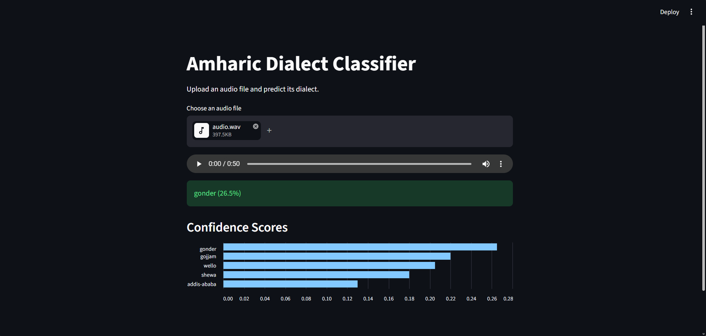

# Amharic Dialect Classifier



## Overview

This project identifies the dialect of spoken Amharic from an audio recording. The system extracts MFCC-based acoustic features from speech and uses a Random Forest classifier to predict one of five dialects:

- Addis Ababa
- Gojjam
- Gonder
- Shewa
- Wello

A Streamlit web application allows users to upload audio files and view predictions with confidence scores.

## Features

* Audio-only dialect classification
* MFCC-based feature extraction
* Random Forest classifier
* Confidence score prediction
* Interactive Streamlit demo
* Reproducible training pipeline

## Dataset

This project uses the Leyu Amharic Dialect datasets hosted on Hugging Face.

| Dialect | Dataset |
|----------|----------|
| Addis Ababa | https://huggingface.co/datasets/gheero-Leyu/leyu-amharic-addis-ababa-dialect |
| Gojjam | https://huggingface.co/datasets/leyu-amharic/leyu-amharic-gojjam-dialect |
| Gonder | https://huggingface.co/datasets/leyu-amharic/leyu-amharic-gonder-dialect |
| Shewa | https://huggingface.co/datasets/leyu-amharic/leyu-amharic-shewa-dialect |
| Wello | https://huggingface.co/datasets/leyu-amharic/leyu-amharic-wello-dialect |

The datasets contain speech recordings and metadata including dialect, speaker ID, gender, and transcripts.

Only the audio recordings and dialect labels were used during training.

### Attribution

The Leyu Amharic Dialect datasets are provided by the Leyu Amharic project and are licensed under the Creative Commons Attribution 4.0 International (CC BY 4.0) license.

If you use this project or the underlying datasets in research or derivative work, please provide appropriate attribution to the original dataset creators.

License: https://creativecommons.org/licenses/by/4.0/

## Project Structure

```text
amharic-dialect-classifier/

├── data/                 # ignored
├── images/
│   └── demo.png
│
├── models/
│   └── dialect_model.pkl
│
├── src/
│   ├── load_data.py
│   ├── feature_extraction.py
│   ├── train.py
│   └── predict.py
│
├── app.py
├── requirements.txt
├── README.md
├── .gitignore
```

## Methodology

### 1. Data Loading

The datasets are stored as Parquet files and loaded using Pandas.

### 2. Audio Processing

Audio recordings are decoded from WAV byte streams and converted into NumPy arrays.

### 3. Feature Extraction

The following audio features are extracted:

* MFCC (20 coefficients)
* MFCC means and standard deviations
* Zero Crossing Rate
* Spectral Centroid
* Spectral Rolloff

This results in a 46-dimensional feature vector for each recording.

### 4. Model Training

A Random Forest classifier is trained on the extracted audio features.

```python
RandomForestClassifier(
    n_estimators=200,
    class_weight="balanced",
    random_state=101
)
```

### 5. Prediction

For an uploaded audio file:

1. Audio features are extracted.
2. The trained model predicts the dialect.
3. Confidence scores are generated using prediction probabilities.

## Results

Development dataset results:

| Metric   | Value |
| -------- | ----- |
| Accuracy | 65.5% |
| Classes  | 5     |
| Features | 46    |

Classification Report:

| Dialect     | F1 Score |
| ----------- | -------- |
| Addis Ababa | 0.72     |
| Gojjam      | 0.58     |
| Gonder      | 0.57     |
| Shewa       | 0.76     |
| Wello       | 0.64     |

## Running the Project

### Create Virtual Environment

```bash
python -m venv .venv
```

### Activate Environment

Windows:

```bash
.venv\Scripts\activate
```

### Install Dependencies

```bash
pip install -r requirements.txt
```

### Train Model

```bash
python -m src.train
```
Can be skipped and the pre-trained model provided can be used instead.

### Launch Streamlit App

```bash
streamlit run app.py
```

## Example Output

```text
Predicted Dialect: Gonder(72%)

Confidence Scores

Gonder      72%
Wello       12%
Addis       8%
Shewa       5%
Gojjam      3%
```

## Future Improvements

* Train on the complete dataset
* Compare Random Forest and SVM models
* Add feature caching
* Experiment with deep learning approaches
* Deploy Streamlit application online

## Acknowledgements

This project uses the Leyu Amharic Dialect datasets made publicly available by the Leyu Amharic project. The authors and contributors of the dataset deserve full credit for collecting and publishing the speech recordings used in this work.

## License

The source code in this repository is licensed under the MIT License.

The datasets used in this project are licensed separately under the CC BY 4.0 license by their respective creators. See the Dataset section for attribution and licensing information.

## Author

Kirubel Lemma Yadecha
